<div align="center">



<br/>

[](https://nextjs.org/)
[](https://travia-journal.vercel.app)
[](https://github.com/dvphnc)
[](https://travia-journal.vercel.app)

</div>


## What is Travia?

Travia is a travel blog built for everyone, not just travelers.

> You don't need a passport or a boarding pass to feel something reading about hidden temples at the edge of Kyoto, or to be surprised that a Welsh-speaking community somehow took root in the middle of Patagonia.

Travia is a place where anyone can sit down, read a story, and feel like they've been somewhere. Every post pairs a destination with a piece of trivia. Something unexpected. Something that makes you stop and think *I had no idea.*

This started as a personal project, a way to learn, build, and make something I'd actually want to open. It turned into one of the things I'm most proud of building.

---

## What I Built

> A full Next.js application with static generation, a serverless API, and everything styled by hand. No UI libraries, no shortcuts.

<details>
<summary>&nbsp;<b>The reading experience</b></summary>
<br/>
Each article has a clean single-column layout with a lead paragraph, a trivia box, and a travel tips section. There is a reading progress bar at the top of each page and a sticky sidebar that holds post info, share options, and related stories. The goal was to make reading feel unhurried and worth finishing.
</details>

<details>
<summary>&nbsp;<b>Navigation and search</b></summary>
<br/>
Three category pages for Asia, Europe, and the Americas. A search page that filters stories by destination, tag, or keyword. A full story listing so nothing gets buried. The navbar sticks to the top and picks up a soft shadow as you scroll.
</details>

<details>
<summary>&nbsp;<b>Sharing a story</b></summary>
<br/>
Every post has a share panel in the sidebar with buttons for X, Facebook, Instagram, and a copy link option. The cards on the home page have quick share buttons too, so you can send a story along without opening it first.
</details>

<details>
<summary>&nbsp;<b>The welcome screen</b></summary>
<br/>
Every visit to the home page opens with a short splash screen. The logo floats in, the name appears, a loading bar fills, then the site opens. Three seconds. Sets the tone before anything else loads.
</details>

<details>
<summary>&nbsp;<b>The details</b></summary>
<br/>
Reading time on every card. Fallback images so broken links never break the layout. A back-to-top button that only appears when needed. Open Graph tags so shared links look right everywhere. A mobile menu that works properly. All of it written from scratch.
</details>

---

## Built With

```
Next.js 14      Pages Router, static site generation
JavaScript      No TypeScript, keeping it approachable
Custom CSS      Written from scratch, no frameworks
Vercel          Hosting and automatic deployment
Unsplash        Photography
```

---

## Run It Locally

> Clone the repo, install dependencies, and you're running in under a minute.

```bash
git clone https://github.com/dvphnc/travia-journal.git
cd travia-journal
npm install
npm run dev
```

Open `http://localhost:3000` and you're in.

```bash
npm run build
npm start
```

---

## How It's Organized

```
travia-journal/
│
├── components/
│   ├── Layout.js          head, meta tags, page wrapper
│   ├── Navbar.js          sticky nav, search, mobile menu
│   ├── Footer.js          links, back to top, progress bar
│   ├── PostCard.js        thumbnail, tags, quick share
│   └── SplashScreen.js    animated welcome on home load
│
├── data/
│   ├── posts.js           title, image, tags, excerpt per post
│   └── postContent.js     full article HTML per story
│
├── pages/
│   ├── index.js           home
│   ├── about.js           about
│   ├── contact.js         contact form
│   ├── search.js          search results
│   ├── all-posts.js       full story listing
│   ├── asia.js            asia category
│   ├── europe.js          europe category
│   ├── americas.js        americas category
│   └── post/[slug].js     article with sidebar
│
├── pages/api/
│   └── contact.js         serverless contact handler
│
├── public/
│   └── ...                logo, favicon, readme assets
│
└── styles/
    └── globals.css        everything, written by hand
```

---

<div align="center">


<sub>© 2025 Travia Journal by Joana Daphne Sy. All rights reserved.</sub>

</div>
